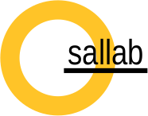

# thesallab.opendata

OpenData contains all the data and results used in the publications of the
 SaL Lab.
 
As a detailed list:
* [2001](2001): Open data for manuscript entitled "Identifying Searchers’ Domain Expertise in Engineering Tasks", submitted as a short paper to SIGIR 2020.
# License
Unless otherwise specified, all the data and results are licensed under [CC
 BY 4.0](https://creativecommons.org/licenses/by/4.0/). Please cite the
  according paper(s). Thank you!
